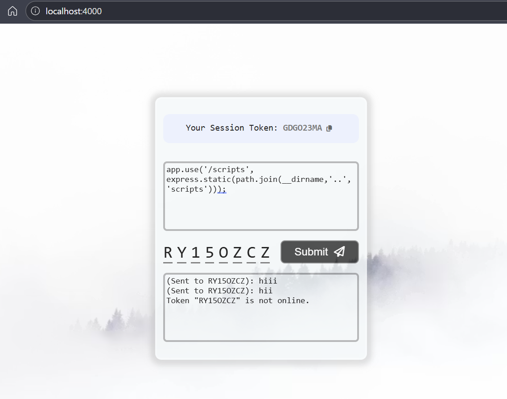

# 💬 Text Messaging with WebSockets

<div align="center">

<!-- TODO: Add project logo (e.g., a chat bubble icon) -->

[](https://github.com/SketchArtist07/Text-Messaging-with-WebSockets/issues)

[](LICENSE)

**A lightweight demonstration of real-time text messaging using WebSockets and Express.**
</div>

## 📖 Overview

This project is a small, focused application designed to showcase real-time, one-to-one text messaging capabilities using WebSockets. It features a simple Express.js backend server that handles WebSocket connections and message routing, paired with a vanilla JavaScript frontend client.

The application allows users to establish unique sessions, identified by a token, and send messages to other active sessions. The user interface mimics a console-like chat experience, providing an intuitive way to input a recipient's session token and a message, then transmit it in real-time to the target. This setup is ideal for understanding the fundamental principles of WebSocket communication and building interactive, real-time features in web applications.

## ✨ Features

-   🎯 **Real-time Messaging:** Instant message delivery between connected clients via WebSockets.
-   🔑 **Session-based Targeting:** Messages are routed to specific client sessions using unique tokens.
-   🖥️ **Console-like Chat UI:** A minimal, command-line inspired interface for sending and receiving messages.
-   🌐 **Express.js Backend:** A simple, efficient server to manage WebSocket connections and message relay.
-   ⚙️ **Client-side Logic:** Pure JavaScript for handling WebSocket events and updating the UI.

## 🖥️ Screenshots

<!-- TODO: Add actual screenshots of the application, showing both sending and receiving messages. -->
<!-- Example: -->

<!--  -->

## 🛠️ Tech Stack

**Frontend:**


**Backend:**


## 🚀 Quick Start

Follow these steps to get the Text Messaging with WebSockets application up and running on your local machine.

### Prerequisites
-   Node.js (LTS version recommended)
-   npm (Node Package Manager, usually bundled with Node.js)

### Installation

1.  **Clone the repository**
    ```bash
    git clone https://github.com/SketchArtist07/Text-Messaging-with-WebSockets.git
    cd Text-Messaging-with-WebSockets
    ```

2.  **Install dependencies**
    ```bash
    npm install
    ```

3.  **Start Application Server**
    The server will host both the backend API and the static frontend files.
    ```bash
    node server/server.js
    ```

4.  **Open your browser**
    Visit `http://localhost:4000` (assuming default Express port) in multiple browser tabs or windows to simulate different users. Each new tab will automatically generate a unique session token for that client.

## 📁 Project Structure

```
Text-Messaging-with-WebSockets/
├── LICENSE             # Project license file
├── images/             # Directory for screenshots or project visuals
├── package.json        # Node.js project manifest
├── package-lock.json   # Records exact dependency versions
├── public/             # Static frontend assets (HTML, CSS, client-side JS)
│   ├── index.html      # Main HTML file for the client interface
├── scripts/            # Potentially utility scripts (e.g., build, deployment helpers)
│   └── script.js       # Client-side JavaScript for WebSocket interaction
└── server/             # Backend server code
    └── server.js        # Main Express.js server entry point and WebSocket handler
```
*(Note: `scripts/script.js` is an inferred client-side JavaScript file, and `server/server.js` is an inferred server entry point based on common Node.js project structures for this type of application.)*

## ⚙️ Configuration

This project is designed for simplicity and demonstration, and does not currently use a separate configuration file or environment variables (`.env`). All server and client configurations are hardcoded within their respective JavaScript files.

-   **Server Port**: The server typically runs on port `4000`. This can be modified directly in `server/server.js` if needed.
-   **WebSocket URL**: The client connects to the WebSocket endpoint on the same host and port as the HTTP server (`ws://localhost:4000`). This can be modified in `scripts/script.js`.

## 🔧 Development

### Available Scripts

| Command        | Description                                    |

| -------------- | ---------------------------------------------- |

| `npm install`  | Installs all project dependencies.              |

| `node server/server.js`    | Starts the Express.js server and hosts the client. |

### Development Workflow
To begin development, ensure all dependencies are installed using `npm install`. Then, start the server with `node server/server.js`. Any changes to the `server/server.js` file will require a server restart for changes to take effect. Changes to `public` directory files (`.html`) will be reflected upon browser refresh.

## 🧪 Testing

This project does not include explicit unit or integration tests. Testing is currently performed manually by running the application and interacting with the chat interface in multiple browser tabs or windows.

## 🚀 Deployment

To deploy this application:

1.  **Production Build**: This project does not require a separate build step for its client-side assets as it uses vanilla HTML, CSS, and JavaScript.
2.  **Hosting**: The Node.js server serves both the backend logic and the static frontend files. You can deploy this application to any platform that supports Node.js applications, such as Heroku, Vercel (for Node.js serverless functions), AWS EC2, DigitalOcean Droplets, or a custom VPS.
    *   Ensure that the chosen hosting environment has Node.js and npm installed.
    *   Upload the project files, install dependencies (`npm install`), and then run the application using `npm start`.
    *   Configure your hosting provider to expose the application's port (e.g., 3000) and redirect traffic as necessary.

## 📚 API Reference

The application exposes a single HTTP endpoint for serving the client and a WebSocket endpoint for real-time communication.

### HTTP Endpoint
-   `GET /`: Serves the `public/index.html` file and its associated static assets (CSS, client-side JS).

### WebSocket Endpoint
-   `ws://[your-app-domain]:[port]/`: Establishes a WebSocket connection.
    -   **Client Initialization**: Upon connection, the server assigns a unique session token to the client. This token is displayed in the client's UI and used for targeting messages.
    -   **Sending Messages**: Clients send messages in JSON format over the WebSocket connection. The expected structure is:
        ```json
        {
          "recipient": "TARGET_TOKEN",
          "message": "Hello, this is my message!"
        }
        ```
    -   **Receiving Messages**: Clients receive messages in JSON format, which are then displayed in their console-like UI. The received message structure is:
        ```json
        {
          "sender": "SENDER_TOKEN",
          "message": "Hello from another user!"
        }
        ```

## 🤝 Contributing

We welcome contributions to this project! If you'd like to improve the application or add new features, please consider the following:

1.  **Fork the repository**.
2.  **Create a new branch** (`git checkout -b feature/your-feature-name`).
3.  **Make your changes**.
4.  **Commit your changes** (`git commit -m 'feat: Add new feature'`).
5.  **Push to the branch** (`git push origin feature/your-feature-name`).
6.  **Open a Pull Request**.

## 📄 License

This project is licensed under the [MIT License](LICENSE) - see the [LICENSE](LICENSE) file for details.

## 🙏 Acknowledgments

-   Built with [Node.js](https://nodejs.org/)
-   Web server powered by [Express.js](https://expressjs.com/)
-   Real-time communication enabled by [WebSockets](https://developer.mozilla.org/en-US/docs/Web/API/WebSockets_API)

## 📞 Support & Contact

-   🐛 Issues: [GitHub Issues](https://github.com/SketchArtist07/Text-Messaging-with-WebSockets/issues)
-   📧 Contact: [SketchArtist07](https://github.com/SketchArtist07) <!-- TODO: Add a specific contact email if desired -->

---

<div align="center">

**⭐ Star this repo if you find it helpful!**

Made with ❤️ by [SketchArtist07](https://github.com/SketchArtist07)

</div>

